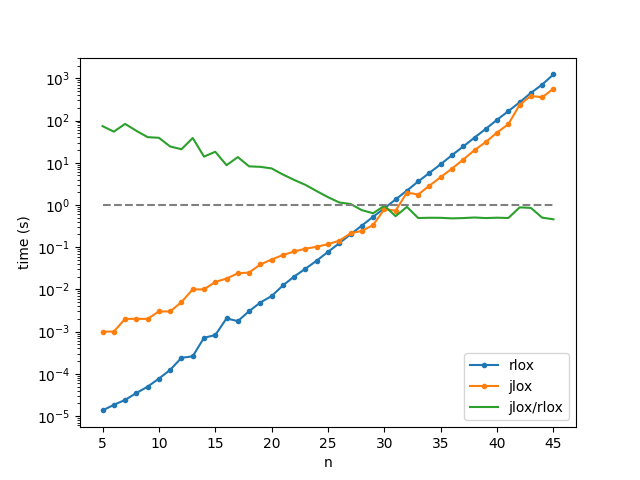

<div align="center">
    <h1> RLox </h1>
    <h6> A <a href="https://craftinginterpreters.com/the-lox-language.html">Lox</a> interpreter written in Rust </h6>
    </br>
</div>

This is an implementation of an interpreter for the Lox programming language form the [Crafting Inerpreters](https://craftinginterpreters.com) book. This tries to follow the while also attempting to write the interpreter using idiomatic Rust patterns and features.

This also draws inspiration from the [rust compiler](https://github.com/rust-lang/rust/).

## Usage

There are two ways to use this interpreter 

### Interactive interpreter 

Run with `cargo run` and a [REPL](https://en.wikipedia.org/wiki/Read%E2%80%93eval%E2%80%93print_loop) with pop for in interactive experience. You can quit the language shell with `Ctrl+D`.

### Script interpreter

This also works as a CLI program. Run with the `--help` option to see the usage message:

```
Usage: rlox [SCRIPT]

Arguments:
  [SCRIPT]  Script to run

Options:
  -h, --help     Print help
  -V, --version  Print version
```

## Grammar

This is the current grammar the interpreter supports

```
program        -> declaration* EOF ;
declaration    -> classDecl 
               | funDecl
               | varDecl
               | statement ;
statement      -> exprStmt
               | forStmt
               | ifStmt
               | jumpStmt
               | printStmt
               | returnStmt
               | whileStmt
               | block ;
classDecl      -> "class" IDENTIFIER ( "<" IDENTIFIER )? "{" function* "}" ;
funDecl        -> "fun" function ;
function       -> IDENTIFIER "(" paremeters? ")" block ;
parameters     -> IDENTIFIER ( "," IDENTIFIER )* ;
exprStmt       -> expression ";" ;
jumpStmt       -> ( "break" | "continue" ) ";" ;
forStmt        -> "for" "(" ( varDecl | exprStmt | ";" )
                 expression? ";"
                 expression? ")" statement ;
ifStmt         -> "if" "(" expression ")" statement
               ( "else" statement )? ;
printStmt      -> "print" expression ";" ; 
returnStmt     -> "return" expression? ";" ;
whileStmt      -> "while" "(" expression ")" statement ;
block          -> "{" declaration* "}" ;
varDecl        -> "var" IDENTIFIER ( "=" expression )? ";" ;
expression     -> comma ;
comma          -> assignment ( "," assignment )* ;
assignment     -> ( call "." )? IDENTIFIER "=" assignment
               | logic_or ( "?" expression ":" assignment )?
               | logic_or ;
logic_or       -> logic_and ( "or" logic_and )* ;
logic_and      -> equality ( "and" equality )* ;
equality       -> comparison ( ( "!=" | "==" ) comparison )* ;
comparison     -> term ( ( ">" | ">=" | "<" | "<=" ) term )* ;
term           -> factor ( ( "-" | "+" ) factor )* ;
factor         -> unary ( ( "/" | "*" ) unary )* ;
unary          -> ( "!" | "-" ) unary
               | call ;
call           -> primary ( "(" arguments? ")" | "." IDENTIFIER )* ;
arguments      -> assignment ( "," assignment )* ;
primary        -> "true" | "false" | "nil"
               | NUMBER | STRING | IDENTIFIER | "(" expression ")"
               | "super" "." IDENTIFIER ;
```

## Notes

See [NOTES.md](./NOTES.md) for some notes on development and places this implementation diverges from the book.

## Correctness 

I tested `rlox` against the tests provided in [craftinginterpreters' repo](https://github.com/munificent/craftinginterpreters) in the `jlox` version. There are only 7 tests that don't pass and I have a section in the notes explaining why they are left like that.

## Benchmarks

> [!NOTE]
> This section is evolving. Previous version of the benchmarks at #80d2e61.

Initial benchmark showed a surprising (for me) result. `jlox` beats `rlox` (almost) everytime and runs ~3 times faster. The following is the revised benchmark, the results are all improvements from the first version:


```
» for TEST in test/benchmark/*; do hyperfine "./jlox $TEST" "rlox $TEST"; done
Benchmark 1: ./jlox test/benchmark/binary_trees.lox
  Time (mean ± σ):      8.311 s ±  0.155 s    [User: 9.421 s, System: 0.108 s]
  Range (min … max):    8.201 s …  8.735 s    10 runs

Benchmark 2: rlox test/benchmark/binary_trees.lox
  Time (mean ± σ):     20.358 s ±  0.095 s    [User: 20.212 s, System: 0.038 s]
  Range (min … max):   20.162 s … 20.474 s    10 runs

Summary
  ./jlox test/benchmark/binary_trees.lox ran
    2.45 ± 0.05 times faster than rlox test/benchmark/binary_trees.lox
Benchmark 1: ./jlox test/benchmark/equality.lox
  Time (mean ± σ):      8.019 s ±  0.170 s    [User: 8.134 s, System: 0.047 s]
  Range (min … max):    7.757 s …  8.293 s    10 runs

Benchmark 2: rlox test/benchmark/equality.lox
  Time (mean ± σ):     25.032 s ±  0.197 s    [User: 24.930 s, System: 0.008 s]
  Range (min … max):   24.693 s … 25.280 s    10 runs

Summary
  ./jlox test/benchmark/equality.lox ran
    3.12 ± 0.07 times faster than rlox test/benchmark/equality.lox
Benchmark 1: ./jlox test/benchmark/fib.lox
  Time (mean ± σ):      6.149 s ±  1.931 s    [User: 6.297 s, System: 0.056 s]
  Range (min … max):    4.515 s …  8.417 s    10 runs

  Warning: The first benchmarking run for this command was significantly slower than the rest (8.398 s). This could be caused by (filesystem) caches that were not filled until after the first run. You should consider using the '--warmup' option to fill those caches before the actual benchmark. Alternatively, use the '--prepare' option to clear the caches before each timing run.

Benchmark 2: rlox test/benchmark/fib.lox
  Time (mean ± σ):      7.928 s ±  0.015 s    [User: 7.892 s, System: 0.004 s]
  Range (min … max):    7.898 s …  7.949 s    10 runs

Summary
  ./jlox test/benchmark/fib.lox ran
    1.29 ± 0.40 times faster than rlox test/benchmark/fib.lox
Benchmark 1: ./jlox test/benchmark/instantiation.lox
  Time (mean ± σ):      1.587 s ±  0.032 s    [User: 1.873 s, System: 0.057 s]
  Range (min … max):    1.549 s …  1.635 s    10 runs

Benchmark 2: rlox test/benchmark/instantiation.lox
  Time (mean ± σ):      4.400 s ±  0.011 s    [User: 4.382 s, System: 0.001 s]
  Range (min … max):    4.386 s …  4.425 s    10 runs

Summary
  ./jlox test/benchmark/instantiation.lox ran
    2.77 ± 0.06 times faster than rlox test/benchmark/instantiation.lox
Benchmark 1: ./jlox test/benchmark/invocation.lox
  Time (mean ± σ):      1.480 s ±  0.015 s    [User: 1.733 s, System: 0.056 s]
  Range (min … max):    1.452 s …  1.503 s    10 runs

Benchmark 2: rlox test/benchmark/invocation.lox
  Time (mean ± σ):      3.236 s ±  0.041 s    [User: 3.222 s, System: 0.002 s]
  Range (min … max):    3.196 s …  3.341 s    10 runs

Summary
  ./jlox test/benchmark/invocation.lox ran
    2.19 ± 0.04 times faster than rlox test/benchmark/invocation.lox
Benchmark 1: ./jlox test/benchmark/method_call.lox
  Time (mean ± σ):      1.967 s ±  0.026 s    [User: 2.663 s, System: 0.053 s]
  Range (min … max):    1.936 s …  2.013 s    10 runs

Benchmark 2: rlox test/benchmark/method_call.lox
  Time (mean ± σ):      2.063 s ±  0.012 s    [User: 2.054 s, System: 0.001 s]
  Range (min … max):    2.053 s …  2.091 s    10 runs

Summary
  ./jlox test/benchmark/method_call.lox ran
    1.05 ± 0.02 times faster than rlox test/benchmark/method_call.lox
Benchmark 1: ./jlox test/benchmark/properties.lox
  Time (mean ± σ):      4.846 s ±  0.029 s    [User: 5.114 s, System: 0.057 s]
  Range (min … max):    4.806 s …  4.910 s    10 runs

Benchmark 2: rlox test/benchmark/properties.lox
  Time (mean ± σ):      4.967 s ±  0.024 s    [User: 4.941 s, System: 0.005 s]
  Range (min … max):    4.926 s …  5.009 s    10 runs

Summary
  ./jlox test/benchmark/properties.lox ran
    1.03 ± 0.01 times faster than rlox test/benchmark/properties.lox
Benchmark 1: ./jlox test/benchmark/string_equality.lox
  Time (mean ± σ):      8.353 s ±  0.102 s    [User: 8.670 s, System: 0.034 s]
  Range (min … max):    8.159 s …  8.467 s    10 runs

Benchmark 2: rlox test/benchmark/string_equality.lox
  Time (mean ± σ):     16.227 s ±  0.062 s    [User: 16.161 s, System: 0.002 s]
  Range (min … max):   16.095 s … 16.329 s    10 runs

Summary
  ./jlox test/benchmark/string_equality.lox ran
    1.94 ± 0.02 times faster than rlox test/benchmark/string_equality.lox
Benchmark 1: ./jlox test/benchmark/trees.lox
  Time (mean ± σ):     24.297 s ±  0.175 s    [User: 25.205 s, System: 0.116 s]
  Range (min … max):   23.852 s … 24.461 s    10 runs

Benchmark 2: rlox test/benchmark/trees.lox
  Time (mean ± σ):     30.519 s ±  0.095 s    [User: 30.237 s, System: 0.152 s]
  Range (min … max):   30.403 s … 30.687 s    10 runs

Summary
  ./jlox test/benchmark/trees.lox ran
    1.26 ± 0.01 times faster than rlox test/benchmark/trees.lox
Benchmark 1: ./jlox test/benchmark/zoo_batch.lox
  Time (mean ± σ):     10.075 s ±  0.008 s    [User: 10.493 s, System: 0.057 s]
  Range (min … max):   10.062 s … 10.086 s    10 runs

Benchmark 2: rlox test/benchmark/zoo_batch.lox
  Time (mean ± σ):     10.013 s ±  0.008 s    [User: 9.974 s, System: 0.002 s]
  Range (min … max):   10.004 s … 10.023 s    10 runs

Summary
  rlox test/benchmark/zoo_batch.lox ran
    1.01 ± 0.00 times faster than ./jlox test/benchmark/zoo_batch.lox
Benchmark 1: ./jlox test/benchmark/zoo.lox
  Time (mean ± σ):      4.456 s ±  0.022 s    [User: 4.759 s, System: 0.055 s]
  Range (min … max):    4.419 s …  4.483 s    10 runs

Benchmark 2: rlox test/benchmark/zoo.lox
  Time (mean ± σ):      3.615 s ±  0.031 s    [User: 3.599 s, System: 0.001 s]
  Range (min … max):    3.582 s …  3.661 s    10 runs

Summary
  rlox test/benchmark/zoo.lox ran
    1.23 ± 0.01 times faster than ./jlox test/benchmark/zoo.lox
```
This surprised me because, well..., it's Rust vs. Java. I also had ran a benchmark while implementing functions using [the fibonacci example from the book](https://craftinginterpreters.com/functions.html#return-statements) and `rlox` was way faster and it still is:

```
craftinginterpreters (master*) » cat ~/test.lox
fun fib(n) {
  if (n <= 1) return n;
  return fib(n - 2) + fib(n - 1);
}

for (var i = 0; i < 20; i = i + 1) {
  print fib(i);
}
craftinginterpreters (master*) » hyperfine "./jlox ~/test.lox"  "rlox ~/test.lox"
Benchmark 1: ./jlox ~/test.lox
  Time (mean ± σ):     204.1 ms ±  28.5 ms    [User: 349.7 ms, System: 46.7 ms]
  Range (min … max):   181.5 ms … 292.5 ms    16 runs

Benchmark 2: rlox ~/test.lox
  Time (mean ± σ):      19.0 ms ±   1.4 ms    [User: 18.4 ms, System: 0.6 ms]
  Range (min … max):    17.8 ms …  29.3 ms    96 runs

  Warning: The first benchmarking run for this command was significantly slower than the rest (29.3 ms). This could be caused by (filesystem) caches that were not filled until after the first run. You should consider using the '--warmup' option to fill those caches before the actual benchmark. Alternatively, use the '--prepare' option to clear the caches before each timing run.

Summary
  rlox ~/test.lox ran
   10.74 ± 1.68 times faster than ./jlox ~/test.lox
```

This is exacly the same program as the `fib.lox` benchmark but with a lower `n`. Actually, I did some more benchmarking changing the `n` with both `jlox` and `rlox` and these are the results:

<div align="center">
    
    <p>(mind that the $y$ axis is in logarithmic scale)</>
</div>

As you can see, for small `n`s `rlox` outperforms `jlox` (see the green line), but the difference starts to get smaller until `rlox` is actually slower by approximately a constant factor. I have no idea what could be the change that makes this happen. The `rlox` times are what one would expect: exponential grouth from the `O(2^n)` complexity of the test at a constant pace. But for `jlox` there seems to be two zones with two different exponential factors, and when it turns, it goes faster than `rlox` by a multiplicative factor. 

I did some profiling and from there I guess that the main issue is allocation and deallocation costs on every recursive call, something that the JVM wouldn't probably do. I tried some drop-in-replacement recomendations like `mimalloc` reserving the 3 huge OS pages of 1GiB, but it didn't improve the performance at all, maybe I did it wrong, I don't know. 

